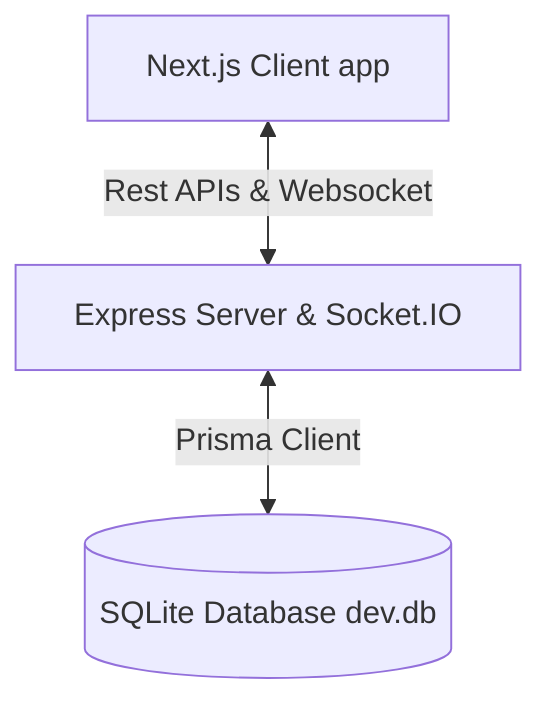

# Rencana & Ringkasan Implementasi EduBattle (PostgreSQL ke SQLite & Real-Time Sync)

Selamat! Integrasi database lokal berbasis SQLite menggunakan Prisma ORM dan sinkronisasi data real-time dengan server Node.js + Next.js client kini telah selesai dikembangkan sepenuhnya secara production-ready dan lulus kompilasi typecheck.

## 🛠️ Modifikasi & Arsitektur Baru



### 1. Database & Schema Adapter (SQLite)
* Diubah datasource provider Prisma dari `postgresql` ke `sqlite` di `server/prisma/schema.prisma` agar platform dapat dijalankan tanpa ketergantungan PostgreSQL server lokal.
* Diubah variabel `DATABASE_URL` ke local file SQLite database `file:./dev.db` pada file `server/.env`.
* Mengonversi model `enum` (seperti `Role`, `Rank`, dan `QuizMode`) ke `String` di dalam database untuk kecocokan optimal SQLite, serta menyematkan fallback default nilai.

### 2. Autentikasi Pengguna Dinamis (`server/src/routes/auth.ts`)
* Mengganti map memori offline `teacherDB` dengan pembacaan database persisten secara penuh.
* Akun demo guru (`username: demo` | `password: demo123`) di-seed secara otomatis saat startup server jika belum ada.
* Login siswa (`login/student`) memvalidasi dan secara otomatis mendaftarkan profil siswa baru ke database (`User` table) dengan inisialisasi stats awal (0 XP, Level 1, BRONZE rank).

### 3. Server CRUD Kuis & Sinkronisasi API (`server/src/routes/quiz.ts`)
* Membuat endpoint `/api/quizzes` (GET, POST, PUT, DELETE) yang dijamin aman menggunakan *teacher auth token middleware*.
* Pembaharuan kuis secara aman menggunakan Prisma database transaction block (`$transaction`) untuk membersihkan pertanyaan & jawaban lama, lalu mengisinya kembali secara atomik.
* Menghubungkan client store `quizStore.ts` dan visual dashboard guru untuk melakukan pemuatan & penyimpanan kuis langsung ke server API persisten (menggantikan LocalStorage).

### 4. Websocket Real-time & Sinkronisasi Progres (`server/src/socket/index.ts`)
* Saat game selesai (`game_over`), server menghitung secara dinamis XP reward masing-masing pemain, memperbarui profil database (`xp`, `level`, `rank`), serta mencatat histori sesi game (`Session` dan `Analytics` tables) secara persisten untuk analisis lebih lanjut.
* Papan Peringkat Global (`client/src/app/leaderboard/page.tsx`) kini dinamis memuat top 20 pemain secara real-time dari API baru `/api/leaderboard`.

---

## ⚡ Cara Menjalankan Aplikasi Secara Lokal

### Langkah 1: Jalankan Migrasi / Dorong Schema Database
Buka PowerShell / Terminal di folder `server` dan jalankan:
```powershell
npx prisma db push
```

### Langkah 2: Jalankan Backend Server
Di dalam folder `server`, jalankan perintah untuk memulai mode development:
```powershell
npm run dev
```
*(Server akan otomatis membuat file `dev.db`, men-seed kuis & user demo, dan mendengarkan pada Port `4000`)*

### Langkah 3: Jalankan Next.js Client
Buka Terminal baru pada folder `client`, dan jalankan:
```powershell
npm run dev
```
*(Client Next.js akan mendengarkan pada Port `3000`)*

---

## 📝 Demo Pengujian Singkat
1. Buka browser ke halaman **`http://localhost:3000/login`**.
2. Masuk menggunakan akun Demo Guru:
   * **Username**: `demo`
   * **Password**: `demo123`
3. Kuis "Demo: Pengetahuan Umum" bawaan database kini siap di-deploy secara instan ke Arena Pertempuran Cyber Dragon!
4. Mainkan game solo di menu **Practice** untuk melihat progres penambahan XP & Level-Up Anda tersinkronisasi.
