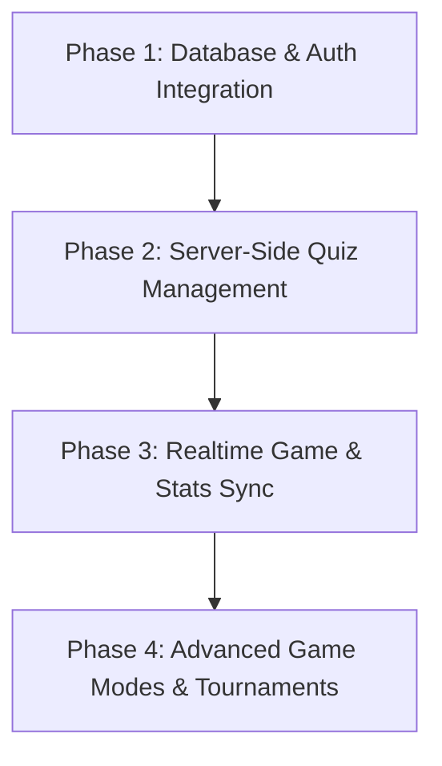

# EduBattle - Development Roadmap

Berdasarkan analisis arsitektur dan kode saat ini, **EduBattle** memiliki pondasi frontend (Next.js) dan real-time logic (Socket.IO) yang solid. Namun, **sistem database (PostgreSQL + Prisma) belum sepenuhnya diintegrasikan**. Banyak data penting masih disimpan secara lokal (`localStorage`) atau bersifat sementara di memori server (*in-memory*).

Berikut adalah rencana pengembangan sistematis untuk membuat platform EduBattle siap produksi.

---

## 🗺️ Prioritas Pengembangan

---

## 1. Fase 1: Integrasi Database & Autentikasi (High Priority)
Saat ini, registrasi guru disimpan dalam memori server (`teacherDB`) yang akan hilang saat server melakukan restart, dan profil siswa disimpan dalam `localStorage`.

### Langkah Kerja:
- [x] **Migrasi Akun Guru ke Prisma**:
  - Ubah `server/src/routes/auth.ts` agar melakukan pencarian dan penyimpanan user langsung ke database menggunakan `prisma.user.findUnique` dan `prisma.user.create`.
  - Pasangkan hashed password menggunakan `bcrypt` sebelum disimpan ke PostgreSQL.
- [x] **Google OAuth**:
  - Implementasikan integrasi Google Sign-In untuk mempermudah pendaftaran guru dan siswa melalui OAuth2 (menggunakan kolom `googleId` pada model `User`).
- [x] **Autentikasi Siswa Terpusat**:
  - Saat siswa masuk ke arena, buat record user baru di database dengan role `SISWA` (atau gunakan session/guest account yang persisten jika tidak ingin memaksa registrasi penuh).

---

## 2. Fase 2: Manajemen Kuis di Sisi Server (CRUD API)
Kuis saat ini disimpan di `localStorage` guru (`client/src/lib/quizStore.ts`). Guru tidak dapat mengakses kuis mereka dari perangkat lain atau membagikannya dengan guru lain secara permanen.

### Langkah Kerja:
- [x] **RESTful API untuk Kuis (`/api/quizzes`)**:
  - Buat file route `server/src/routes/quiz.ts` dengan endpoint:
    - `GET /api/quizzes` (mengambil kuis buatan guru aktif)
    - `GET /api/quizzes/:id` (mengambil detail kuis beserta pertanyaan & jawaban)
    - `POST /api/quizzes` (menyimpan kuis baru ke DB menggunakan Prisma)
    - `PUT /api/quizzes/:id` (memperbarui kuis)
    - `DELETE /api/quizzes/:id` (menghapus kuis)
- [x] **Refaktor Frontend `quizStore.ts`**:
  - Hubungkan `DashboardPage` ke REST API kuis alih-alih `localStorage`.
- [x] **Integrasi AI Generator**:
  - Saat kuis di-generate menggunakan Gemini di `server/src/routes/ai.ts`, langsung simpan kuis tersebut ke database di bawah akun guru yang meminta.

---

## 3. Fase 3: Sinkronisasi Status Permainan, XP, & Achievement
Level, XP, dan achievement siswa saat ini disimpan secara offline (`client/src/lib/xp.ts`). Ini membuat siswa bisa melakukan kecurangan dengan mengubah data `localStorage` mereka secara manual.

### Langkah Kerja:
- [x] **Penyimpanan Hasil Game ke DB**:
  - Di `server/src/socket/index.ts`, pada event `game_over`, simpan hasil permainan setiap siswa ke tabel `Session` dan tabel `Analytics` (termasuk total jawaban benar/salah, waktu rata-rata, dan jumlah percobaan kecurangan `cheatingAttempts` yang ditangkap sistem anti-cheat).
- [x] **Distribusi XP Real-time**:
  - Update kolom `xp`, `level`, dan `rank` pada tabel `User` di database setelah permainan selesai berdasarkan kalkulasi skor akhir.
- [x] **Verifikasi Achievement Server-Side**:
  - Lakukan pengecekan achievement di backend (misal: jika combo > 10, unlock achievement `combo-10` di tabel `UserAchievement`).
- [x] **Global Leaderboard API**:
  - Buat route `/api/leaderboard` untuk menarik peringkat siswa secara dinamis berdasarkan XP secara mingguan (`WEEKLY`), bulanan (`MONTHLY`), atau sepanjang waktu (`ALL_TIME`).

---

## 4. Fase 4: Mode Game Lanjutan & Turnamen ✅
Semua mode game lanjutan telah diimplementasikan dan terintegrasi penuh dengan backend Socket.IO dan Prisma ORM.

### Langkah Kerja:
- [x] **Battle Royale Mode**:
  - Eliminasi real-time — tiap pemain mulai dengan 3 ❤️. Jawaban salah / tidak menjawab mengurangi nyawa. Saat HP = 0, pemain ditandai `eliminated` dan tidak bisa lagi menjawab.
- [x] **Team Battle Mode**:
  - Pemain otomatis dibagi ke Tim 🔴 Merah atau 🔵 Biru secara seimbang saat join. Jawaban benar menambah skor tim masing-masing. Tim dengan skor tertinggi menang.
- [x] **Fitur Turnamen Terjadwal**:
  - REST API `/api/tournaments` (GET, POST, POST /:id/join) terhubung ke Prisma. Guru dapat membuat event turnamen dari Dashboard. Siswa dapat mendaftar dan bersaing di halaman `/tournaments`.
